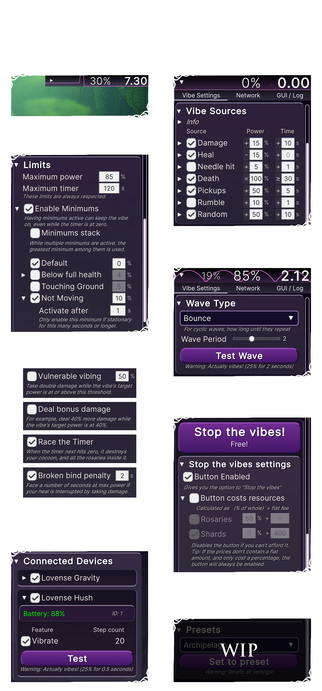

# Buttplug Song

Vibrator support for Hollow Knight: Silksong, for a hornier Hornet. 

## Requirements

You will need:

* A vibrating toy ([compatible device list](https://iostindex.com/?filter0ButtplugSupport=4))
* A copy of [Hollow Knight: Silksong](https://store.steampowered.com/app/1030300/Hollow_Knight_Silksong/)
* A Silksong mod manager, such as [r2modman](https://thunderstore.io/c/hollow-knight-silksong/p/ebkr/r2modman/) (free) 
	* Alternatively, manually configure Silksong modding with BepInEx. But a mod manager will do this for you!
* [Intiface Central](https://intiface.com/#intiface-central) installed and enabled (free)
* A PC with a bluetooth receiver *OR* a smartphone with Intiface Central installed and [relaying](https://intiface.com/docs/intiface-central/ui/app-modes-repeater-panel)

## Installation instructions

1. Install a mod manager such as [r2modman](https://thunderstore.io/c/hollow-knight-silksong/p/ebkr/r2modman/). (Others are available, however not Cogfly as it blocks nsfw mods)
2. Click "Install with Mod Manager" on this mod's [thunderstore page](https://thunderstore.io/c/hollow-knight-silksong/p/danatron1/Buttplug_Song/)
3. On Intiface Central, turn on the server, scan for devices, and ensure your toy is listed. If you're using your phone as a bluetooth relay, follow the relaying instructions linked in the Requirements section.
4. Launch the game through the mod manager. If all is good, the mod will display UI in the upper right, and your toy will be listed under the Network tab.

## Debugging

* Ensure the mod, and Silksong, are up to date.
* Turn VPNs off. (By default the mod tries to connect to `localhost:12345`, however this can be configured)
* Ensure the vibrator is turned on, and seeking a bluetooth connection if applicable.
* If using Lovense Connect, stop! It's discontinued. Use Intiface Central in relay mode instead (see Requirements section).
* Ensure Intiface Central is open, you've started the server, and clicked Start Scanning. The toy should be listed in Intiface.
* Try installing [ModList](https://thunderstore.io/c/hollow-knight-silksong/p/silksong_modding/Modlist/) to check that the mod loads correctly.

(note: The battery display not working is a known issue. It has proved abnormally troublesome to implement. It is shelved for now. You can view battery levels in the Intiface app anyway)

If you're still having issues (e.g. the mod is crashing), please contact me (danatron1) and send a copy of the `LogOutput.txt` debug log from your BepInEx folder. The path should look something like:

`C:\Users\YourNameHere\AppData\Roaming\r2modmanPlus-local\HollowKnightSilksong\profiles\Default\BepInEx`

What am I doing with my life.
